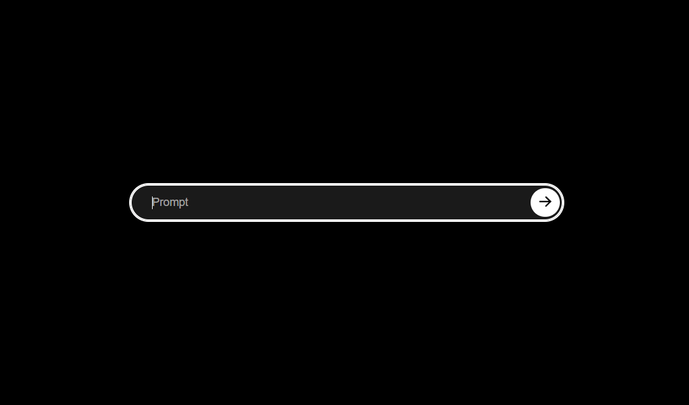

txt2holo
========
[](https://github.com/jjangsangy/txt2holo/actions/workflows/mypy.yml)

Convert text prompts into a 2d holographic images



# Setup
Install dependencies with pip

```bash
pip install -r requirements.txt
```

# Run
First make sure to fill out the environment variables in the `.env.example` file and rename it to `.env`

Ensure that you've filled out either `OPENAI_API_KEY` or `STABILITY_API_KEY` in the `.env` file. Once you've filled out the API keys, set the `IMAGE_BACKEND` to be either `dalle` for openai and `stability` for stabilityai.

Run application by pointing `uvicorn` to the python module
```bash
uvicorn app.main:app
```

# Docker
Run this in a containerized environment with docker

```bash
docker build -it txt2holo .
```

Then run with

```bash
docker run -it -p 8000:8000 -e STABILITY_API_KEY=<API_KEY> -e OPENAI_API_KEY=<OPENAI_API_KEY> txt2holo
```

## Docker Compose
An easier way to run a container is to fill out the `docker-compose-example.yml`, rename it to `docker-compose.yml` and run

```bash
docker compose up
```

# Controls

Txt2holo is designed for holographic displays. When you use this device, the text appears inverted on the screen. To correct this, you can either use hotkeys or click on the screen's edges to invert the text back to normal.

### Hotkeys

| Hotkey          | Description  |
|-----------------|--------------|
| Ctrl-LeftArrow  | Reflect Text |
| Ctrl-RightArrow | Normal Text  |

### Screen Controls

| Touch          | Description  |
|----------------|--------------|
| Tap Left Side  | Reflect Text |
| Tap Right Side | Normal Text  |
| Tap Top Side   | Refresh Page |